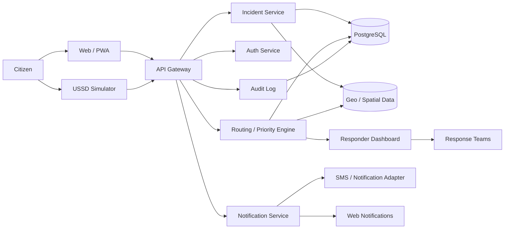

# SANKET — Disaster Response & Citizen Coordination System

> **SANKET** is a web-based disaster-response coordination platform designed to connect citizens, emergency information, and response teams through one resilient workflow.

## 1. Product at a glance

SANKET focuses on the critical period **before, during, and immediately after a disaster**.

It provides:

- Rapid emergency reporting
- Location-aware incident intake
- Web and USSD-style reporting simulation
- Structured SOS data instead of free-form messages alone
- Disaster-type classification
- Priority/severity assessment
- Incident deduplication and clustering
- Response-team routing
- Resource and status tracking
- Citizen-safe status updates
- Offline/degraded-network friendly interaction patterns
- Administrative dashboard and audit trail

## 2. Core principle

```text
Citizen signal
     ↓
Structured incident
     ↓
Validation + classification
     ↓
Priority + location intelligence
     ↓
Response coordination
     ↓
Status updates
     ↓
Resolution + audit
```

## 3. High-level architecture



## 4. Recommended repository structure

```text
sanket/
├── apps/
│   ├── web/
│   └── api/
├── services/
│   ├── incident/
│   ├── routing/
│   ├── notification/
│   └── classification/
├── docs/
│   ├── PRD.md
│   ├── TRD.md
│   ├── APP_FLOW.md
│   ├── IMPLEMENTATION_PLAN.md
│   ├── BACKEND_SCHEMA.md
│   ├── TESTING.md
│   ├── README.md
│   ├── AGENTS.md
│   ├── DESIGN_SYSTEM.md
│   ├── ARCHITECTURE.md
│   ├── SECURITY.md
│   └── CODE_STYLE.md
└── diagrams/
```

## 5. Suggested free-friendly stack

| Layer | Choice |
|---|---|
| Frontend | Next.js / React + TypeScript |
| Styling | Tailwind CSS |
| Maps | Leaflet + OpenStreetMap |
| Backend | Node.js + Fastify/NestJS |
| Database | PostgreSQL + PostGIS |
| Realtime | WebSockets / Socket.IO |
| Validation | Zod |
| Auth | JWT + refresh-token rotation |
| Testing | Vitest + Playwright |
| Deployment | Vercel + Render/Railway/Supabase-style PostgreSQL |
| CI | GitHub Actions |

The exact vendor choice can change without changing the product architecture.

## 6. Documentation map

| Document | Purpose |
|---|---|
| `PRD.md` | What SANKET solves and for whom |
| `TRD.md` | Technical requirements and implementation constraints |
| `APP_FLOW.md` | User journeys and screen-to-screen flows |
| `IMPLEMENTATION_PLAN.md` | Build sequence and milestones |
| `BACKEND_SCHEMA.md` | Database and API data model |
| `TESTING.md` | Test strategy and acceptance criteria |
| `AGENTS.md` | Rules for AI coding agents and contributors |
| `DESIGN_SYSTEM.md` | UI components, tokens and accessibility |
| `ARCHITECTURE.md` | System architecture and data flow |
| `SECURITY.md` | Threat model and security controls |
| `CODE_STYLE.md` | Coding conventions |

## 7. Demo story

A strong demo can follow one realistic incident:

1. A citizen opens SANKET.
2. They select **Flood**.
3. They report: “Water entered ground floor; two elderly people need help.”
4. Location is captured/selected.
5. The system validates the report.
6. A priority is calculated from structured facts.
7. The incident appears on the responder map.
8. Similar nearby reports are clustered.
9. A responder team is assigned.
10. Citizen receives a status update.
11. Responder marks the case **Resolved**.
12. The incident remains available as an auditable record.

## 8. Important product boundary

SANKET is a **coordination and information system**, not a replacement for official emergency services, dispatch infrastructure, or government command systems.

The prototype should clearly label simulated integrations and avoid presenting demo data as live emergency information.
