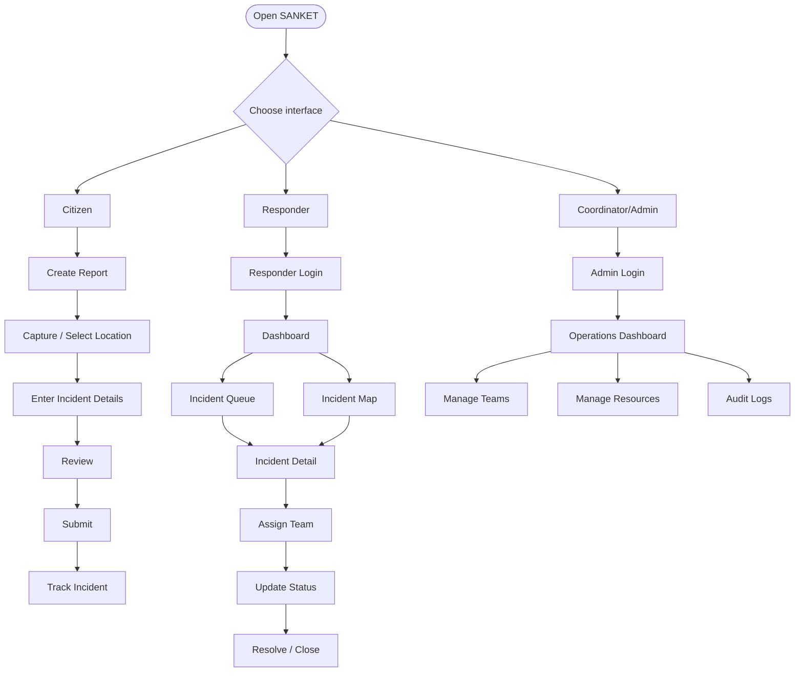
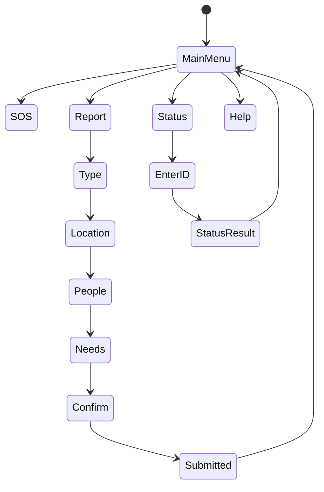
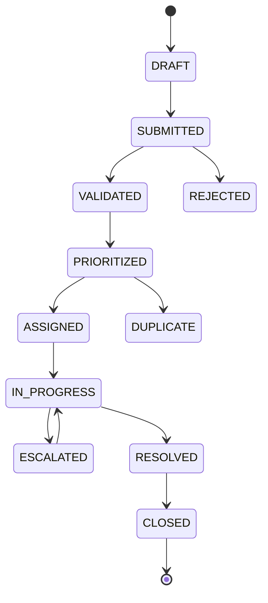

# APP FLOW — Application & User Journeys

## 1. Overall application flow



## 2. Citizen flow

```text
Landing
  ↓
Emergency / Report
  ↓
Disaster type
  ↓
Location
  ↓
People affected
  ↓
Immediate needs
  ↓
Contact consent
  ↓
Review
  ↓
Submit
  ↓
Reference ID
  ↓
Track status
```

## 3. Responder flow

```text
Login
 ↓
Dashboard
 ↓
Filter / Map
 ↓
Open incident
 ↓
Review evidence
 ↓
Assign team
 ↓
Acknowledge
 ↓
In progress
 ↓
Add action note
 ↓
Resolve
```

## 4. USSD simulator flow



## 5. Incident state machine



## 6. Navigation map

```text
PUBLIC
├── Home
├── Report Emergency
├── Track Report
├── Safety Information
└── USSD Simulator

RESPONDER
├── Dashboard
├── Live Map
├── Incidents
│   ├── New
│   ├── Assigned
│   ├── In Progress
│   └── Resolved
├── Teams
└── Profile

ADMIN
├── Operations
├── Incidents
├── Teams
├── Resources
├── Audit Logs
└── System Settings
```

## 7. Error flows

### Missing location

```text
Submit
 ↓
Location missing
 ↓
Explain why location helps
 ↓
Allow map selection
 ↓
Retry
```

### Duplicate report

```text
New report
 ↓
Similarity check
 ↓
Possible duplicate
 ↓
Show nearby matching incidents
 ↓
Citizen confirms
 ├── Same incident → attach information
 └── Different → create new incident
```

### Network failure

```text
Submit
 ↓
Network unavailable
 ↓
Save local draft
 ↓
Show pending state
 ↓
Retry automatically/manual
```
