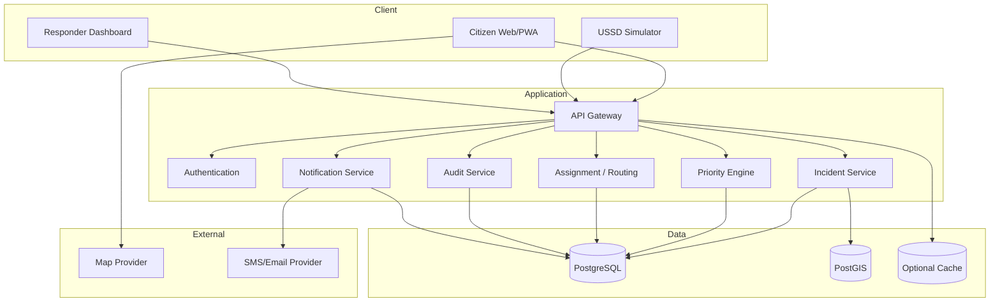
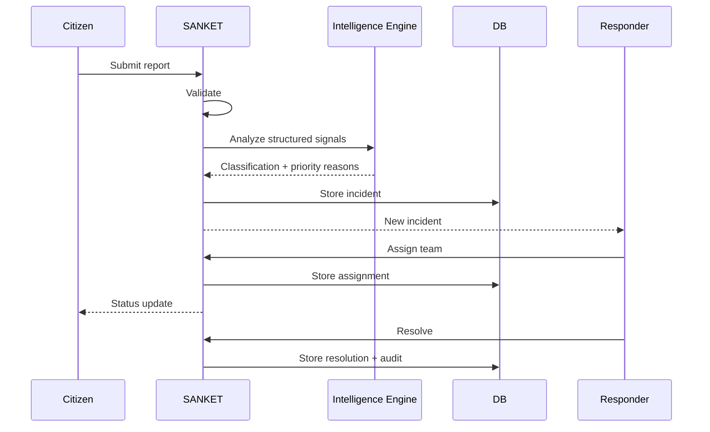

# SYSTEM ARCHITECTURE

## 1. Architecture style

SANKET uses a modular layered architecture.



## 2. Three-layer operational model

This is the core product architecture:

### Layer 1 — Citizen Signal Layer

```text
Web
USSD simulator
Location
Incident details
Needs
```

### Layer 2 — Intelligence & Coordination Layer

```text
Validation
Classification
Priority
Duplicate detection
Geospatial clustering
Assignment
Notifications
```

### Layer 3 — Response Operations Layer

```text
Responder dashboard
Team management
Resource tracking
Status updates
Audit trail
```

## 3. Data flow



## 4. Module boundaries

```text
incident/
  owns incident lifecycle

priority/
  owns deterministic priority rules

routing/
  owns team matching/assignment

notification/
  owns outbound notifications

auth/
  owns authentication and authorization

audit/
  owns immutable operational event records
```

## 5. Deployment topology

```text
User Browser
     ↓
CDN / Web Host
     ↓
API Server
     ↓
Managed PostgreSQL
     ↓
External adapters
```

For a student project, a single backend deployment is sufficient. Keep internal modules separate so they can later become services if scale requires it.

## 6. Resilience principles

- Database transaction around important state changes
- Idempotency for retryable mutations
- Timeouts for external providers
- Graceful notification failure
- Local draft for temporary network loss
- Audit events for critical transitions
- No single external provider should contain the core business logic
