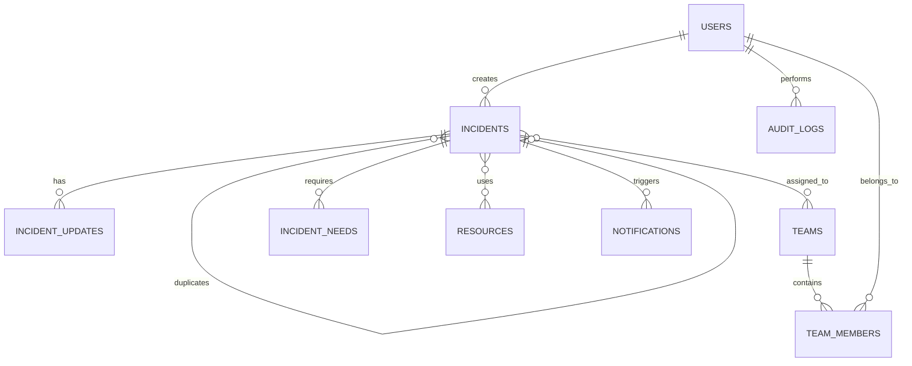

# BACKEND SCHEMA

## 1. Entity relationship overview



## 2. Users

```text
users
-----
id UUID PK
name TEXT
phone TEXT nullable
email TEXT nullable
role ENUM(CITIZEN, RESPONDER, COORDINATOR, ADMIN)
status ENUM(ACTIVE, DISABLED)
created_at TIMESTAMP
updated_at TIMESTAMP
```

## 3. Incidents

```text
incidents
---------
id UUID PK
reference TEXT UNIQUE
created_by UUID FK users.id nullable
type ENUM
description TEXT
status ENUM
priority_level ENUM
priority_score INTEGER
latitude DECIMAL
longitude DECIMAL
people_affected INTEGER
vulnerable_people INTEGER
contact_consent BOOLEAN
duplicate_of UUID FK incidents.id nullable
created_at TIMESTAMP
updated_at TIMESTAMP
resolved_at TIMESTAMP nullable
```

## 4. Incident updates

```text
incident_updates
----------------
id UUID PK
incident_id UUID FK
author_id UUID FK
old_status TEXT
new_status TEXT
message TEXT
created_at TIMESTAMP
```

## 5. Teams

```text
teams
-----
id UUID PK
name TEXT
type ENUM
status ENUM
capacity INTEGER
current_latitude DECIMAL nullable
current_longitude DECIMAL nullable
created_at TIMESTAMP
updated_at TIMESTAMP
```

## 6. Team members

```text
team_members
------------
team_id UUID FK
user_id UUID FK
role TEXT
joined_at TIMESTAMP

PRIMARY KEY(team_id, user_id)
```

## 7. Needs

```text
incident_needs
--------------
id UUID PK
incident_id UUID FK
need_type ENUM
quantity INTEGER nullable
status ENUM
```

Examples:

```text
EVACUATION
MEDICAL
FOOD
WATER
SHELTER
RESCUE
FIRE_RESPONSE
COMMUNICATION
```

## 8. Resources

```text
resources
---------
id UUID PK
name TEXT
type ENUM
quantity INTEGER
available_quantity INTEGER
status ENUM
location_text TEXT
created_at TIMESTAMP
updated_at TIMESTAMP
```

## 9. Notifications

```text
notifications
-------------
id UUID PK
incident_id UUID nullable
recipient_user_id UUID nullable
channel ENUM(IN_APP, SMS, EMAIL, USSD)
status ENUM(PENDING, SENT, FAILED)
title TEXT
message TEXT
created_at TIMESTAMP
sent_at TIMESTAMP nullable
```

## 10. Audit logs

```text
audit_logs
----------
id UUID PK
actor_id UUID nullable
action TEXT
entity_type TEXT
entity_id UUID nullable
metadata JSONB
ip_hash TEXT nullable
created_at TIMESTAMP
```

## 11. Index strategy

Recommended:

```sql
CREATE INDEX idx_incidents_status ON incidents(status);
CREATE INDEX idx_incidents_priority ON incidents(priority_level);
CREATE INDEX idx_incidents_created_at ON incidents(created_at);
CREATE INDEX idx_incidents_type ON incidents(type);
```

For PostGIS:

```sql
CREATE INDEX idx_incidents_location
ON incidents
USING GIST (location);
```

## 12. Data ownership

```text
Citizen
  └── may view own report/status

Responder
  └── may view operational incidents
  └── may update assigned incidents

Coordinator
  └── may assign and manage operations

Admin
  └── manages users/configuration/audit
```
