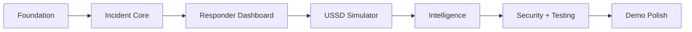

# IMPLEMENTATION PLAN

## 1. Build strategy

Build SANKET vertically rather than completing every frontend feature first.

The recommended order is:



## 2. Phase 0 — Project foundation

### Tasks

- Create repository
- Configure TypeScript
- Configure linting/formatting
- Configure environment variables
- Create database
- Create migrations
- Create shared types
- Create base UI shell

### Done when

- App starts locally
- API starts locally
- Database connects
- CI runs

## 3. Phase 1 — Incident core

Build:
- Incident table
- Create incident API
- Get incident API
- Update status API
- Citizen report form
- Reference ID generation

Demo checkpoint:

```text
Citizen → submit → database → reference ID
```

## 4. Phase 2 — Responder operations

Build:
- Auth
- Roles
- Dashboard
- Incident list
- Incident detail
- Map
- Assignment
- Status updates

Demo checkpoint:

```text
Citizen report → responder sees it → assigns team → resolves it
```

## 5. Phase 3 — USSD simulator

Build:
- Menu state machine
- Numeric input
- Incident creation
- Status lookup
- Session reset

Keep the simulator visually similar to a phone/terminal interaction.

## 6. Phase 4 — Intelligence layer

Implement transparent rules:

- Severity
- Vulnerable persons
- Medical need
- Number affected
- Infrastructure impact
- Geographic clustering
- Duplicate detection

The prototype should show the reasons behind each classification.

## 7. Phase 5 — Notification layer

Implement:
- In-app notification
- Status-change event
- Optional email/SMS adapter
- Notification history

For a student demo, provider calls can be mocked.

## 8. Phase 6 — Security and hardening

- RBAC
- Rate limits
- Input validation
- Secure headers
- Token/session security
- Audit logs
- Sensitive-data minimization
- Error sanitization

## 9. Phase 7 — Testing

Required:
- Unit tests
- API integration tests
- End-to-end happy path
- Validation tests
- RBAC tests
- USSD flow tests

## 10. Phase 8 — Demo polish

- Seed realistic demo incidents
- Add loading states
- Add empty states
- Add responsive layout
- Add map legend
- Add incident timeline
- Add priority explanation
- Add clear "Demo / Simulated" labels to non-live integrations

## 11. Suggested sprint board

| ID | Work item | Priority | Status |
|---|---|---|---|
| S01 | Project setup | P0 | Todo |
| S02 | DB schema | P0 | Todo |
| S03 | Incident API | P0 | Todo |
| S04 | Citizen form | P0 | Todo |
| S05 | Dashboard | P0 | Todo |
| S06 | Map | P0 | Todo |
| S07 | Assignment | P0 | Todo |
| S08 | USSD simulator | P0 | Todo |
| S09 | Priority engine | P1 | Todo |
| S10 | Duplicate detection | P1 | Todo |
| S11 | Notifications | P1 | Todo |
| S12 | Security | P0 | Todo |
| S13 | Tests | P0 | Todo |
| S14 | Demo polish | P0 | Todo |

## 12. Demo acceptance path

```text
1. Open citizen page
2. Submit flood report
3. Capture location
4. Show generated ID
5. Open responder dashboard
6. Show incident on map
7. Open priority explanation
8. Assign Team Alpha
9. Mark In Progress
10. Send simulated citizen update
11. Resolve incident
12. Open audit log
13. Repeat submission through USSD simulator
```
