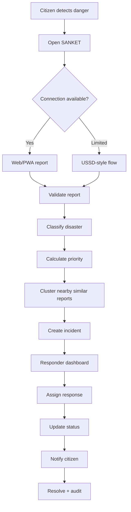

# PRD — Product Requirements Document

## 1. Product name

**SANKET — Disaster Response & Citizen Coordination System**

## 2. Problem statement

During disasters, useful information is often fragmented across calls, messages, social media, local groups, and manually maintained lists. Responders may receive incomplete information, duplicate reports, unclear locations, and changing situation details.

SANKET creates a structured digital path from **citizen report → validated incident → prioritized case → response assignment → status update → resolution**.

## 3. Product goal

Build a demonstrable web platform that improves the organization of disaster reports and helps response teams understand:

- What happened?
- Where did it happen?
- How severe is it?
- Who needs help?
- What resources may be required?
- What is the current status?
- Which reports may refer to the same incident?

## 4. Users

### 4.1 Citizen

Needs:
- Report an emergency quickly
- Provide location
- Communicate essential facts
- Know whether the report was received
- See safe status updates

### 4.2 Responder

Needs:
- View incoming incidents
- Filter by severity/type/status
- See map location
- Understand incident details
- Accept/assign/resolve cases
- Record actions

### 4.3 Coordinator/Admin

Needs:
- Monitor the overall situation
- Manage teams and resources
- Review incidents
- Handle duplicate/spam reports
- Audit important actions

## 5. Primary use cases



## 6. MVP scope

### Must have

- Citizen incident form
- Disaster type selection
- Location selection
- Severity/need questions
- Incident creation
- Responder dashboard
- Map view
- Status lifecycle
- Assignment workflow
- Basic notification simulation
- USSD simulator
- Audit log
- Responsive UI

### Should have

- Incident clustering
- Duplicate detection
- Offline draft
- Priority explanation
- Resource tracking
- Role-based access control

### Could have

- Multilingual interface
- Voice input
- AI-assisted classification
- SMS gateway
- Advanced geospatial analysis
- Public situation map

### Out of scope for first prototype

- Real emergency dispatch
- Autonomous decisions
- Medical diagnosis
- Physical IoT hardware
- Guaranteed emergency communications
- Government-system production integration

## 7. Incident lifecycle

```text
DRAFT
  ↓
SUBMITTED
  ↓
VALIDATED
  ↓
PRIORITIZED
  ↓
ASSIGNED
  ↓
IN_PROGRESS
  ↓
RESOLVED
  ↓
CLOSED
```

Alternative exception states:

```text
SUBMITTED → REJECTED
SUBMITTED → DUPLICATE
ASSIGNED → ESCALATED
```

## 8. Priority model

SANKET should expose a **transparent rule-based priority score** in the prototype.

Example inputs:

| Signal | Example effect |
|---|---|
| Life-threatening danger | Strong increase |
| Person trapped | Strong increase |
| Medical emergency | Strong increase |
| Vulnerable person involved | Increase |
| Multiple people affected | Increase |
| Critical infrastructure affected | Increase |
| Uncertain location | Data-quality warning |
| Duplicate/same incident | Reduce duplicate handling priority |

The UI should show **why** a case received its priority rather than displaying an unexplained number.

## 9. Functional requirements

### FR-01 — Create incident

A citizen shall be able to submit an incident containing:
- Disaster type
- Description
- Location
- Number of people affected
- Immediate needs
- Optional contact information

### FR-02 — Validate input

The system shall reject malformed or incomplete mandatory data.

### FR-03 — Create incident ID

Every accepted incident shall receive a unique public-facing reference.

Example:

```text
SKT-2026-004821
```

### FR-04 — Dashboard

Responders shall see:
- New incidents
- Priority
- Disaster type
- Location
- Current status
- Assignment

### FR-05 — Map

Incidents shall be visualized geographically.

### FR-06 — Assignment

Authorized users shall assign incidents to response teams.

### FR-07 — Status

Authorized users shall update incident status.

### FR-08 — Audit

Security-sensitive actions shall be recorded.

### FR-09 — USSD simulator

The demo shall simulate a constrained-menu interaction:

```text
SANKET
1. SOS
2. Report Disaster
3. Check Status
4. Help

> 2

Select type:
1. Flood
2. Earthquake
3. Landslide
4. Fire

> 1

Location:
1. Share saved location
2. Enter area

> 1

Report submitted.
ID: SKT-2026-004821
```

## 10. Non-functional requirements

| Requirement | Target |
|---|---|
| Responsive | Mobile-first |
| API p95 latency | < 500 ms for normal CRUD operations in prototype |
| Availability | Best-effort demo environment |
| Accessibility | WCAG-oriented contrast, keyboard support, labels |
| Security | RBAC, validation, rate limits, secure cookies/tokens |
| Observability | Structured logs + error IDs |
| Maintainability | TypeScript + modular services |
| Recovery | Database backups where supported |

## 11. Success criteria for the prototype

The demo is successful when a reviewer can:

1. Submit a report.
2. Receive a reference ID.
3. See the incident on the responder dashboard.
4. Understand its priority.
5. Assign a response team.
6. Update the status.
7. See the citizen-facing status.
8. Inspect the audit trail.
9. Repeat the same flow using the USSD simulator.
