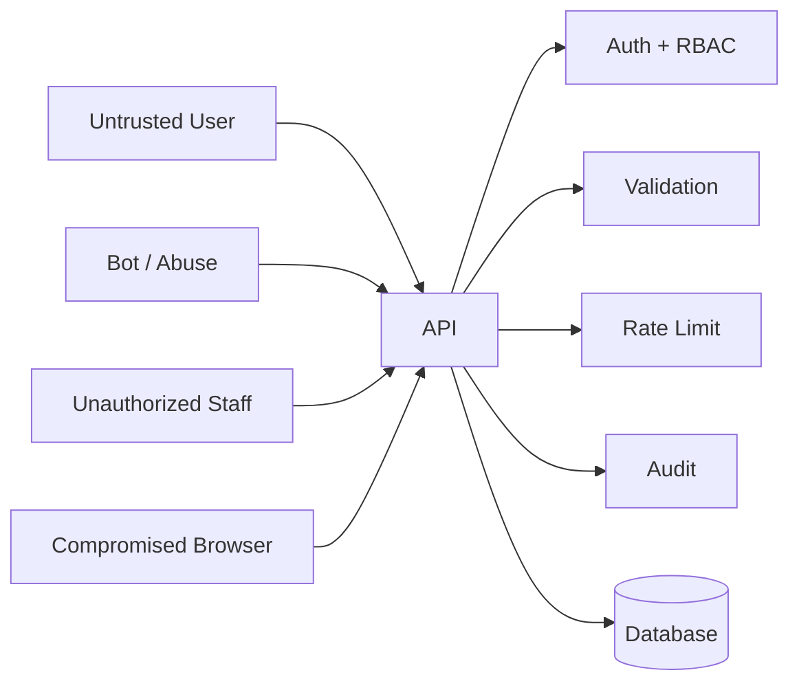

# SECURITY

## 1. Security objective

Protect citizen information, operational data and responder actions while keeping the emergency workflow simple.

## 2. Threat model



## 3. Authentication

Use secure authentication appropriate to the deployment.

For a prototype:
- JWT or secure session cookies
- Short-lived access tokens
- Refresh-token rotation if refresh tokens are used
- Logout/revocation strategy

Never hard-code secrets.

## 4. Authorization

Roles:

```text
CITIZEN
RESPONDER
COORDINATOR
ADMIN
```

Example:

| Action | Citizen | Responder | Coordinator | Admin |
|---|---:|---:|---:|---:|
| Create incident | ✓ | ✓ | ✓ | ✓ |
| View own incident | ✓ | ✓ | ✓ | ✓ |
| View operational queue | — | ✓ | ✓ | ✓ |
| Assign team | — | Limited | ✓ | ✓ |
| Manage users | — | — | — | ✓ |
| View audit | — | Limited | ✓ | ✓ |

The server, not the UI, must enforce permissions.

## 5. Input security

Validate:
- Coordinates
- Enum values
- String lengths
- Numeric ranges
- IDs
- File uploads if later added

Protect against:
- SQL injection
- XSS
- CSRF where applicable
- Prototype pollution
- Oversized payloads

## 6. Privacy

Avoid collecting unnecessary personal information.

Possible citizen data:
- Optional name
- Contact method
- Location
- Incident description

The UI should explain why optional information is requested.

## 7. Logging

Do not log:
- Passwords
- Tokens
- Full sensitive contact data
- Unnecessary personal descriptions

Do log:
- Request ID
- Actor ID
- Action
- Entity ID
- Timestamp
- Result/error code

## 8. Audit trail

Critical actions:

```text
INCIDENT_CREATED
INCIDENT_VALIDATED
PRIORITY_CHANGED
TEAM_ASSIGNED
STATUS_CHANGED
INCIDENT_ESCALATED
INCIDENT_RESOLVED
USER_ROLE_CHANGED
```

## 9. Abuse prevention

Public reporting endpoints should use:
- Rate limiting
- Request size limits
- Basic abuse detection
- CAPTCHA/challenge when appropriate
- Duplicate detection
- Server-side validation

## 10. Security headers

Where supported:

```text
Content-Security-Policy
Strict-Transport-Security
X-Content-Type-Options
Referrer-Policy
Permissions-Policy
```

## 11. Security principle

Treat every client-provided value as untrusted.

```text
Browser says "ADMIN"
        ↓
Server checks authenticated identity
        ↓
Server checks role in database/session
        ↓
Server authorizes operation
```
