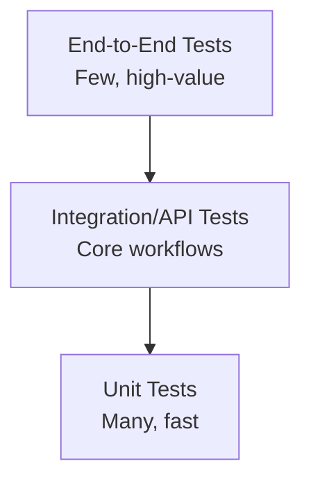
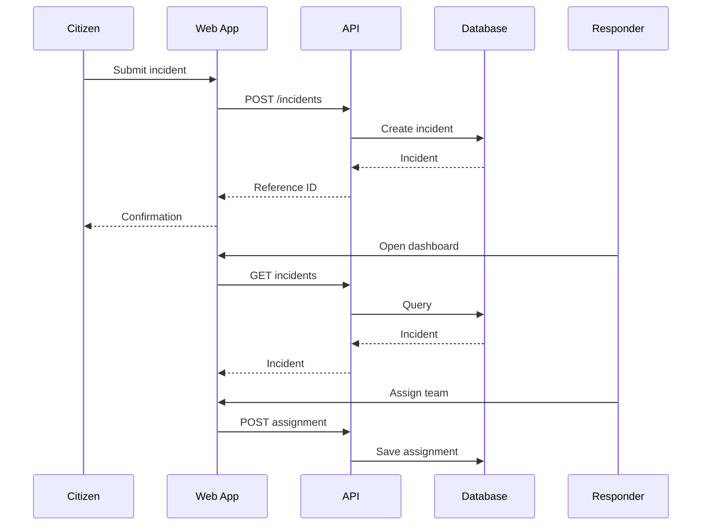

# TESTING STRATEGY

## 1. Testing pyramid



## 2. Unit tests

Test pure logic:

- Priority calculation
- Disaster classification
- Input normalization
- Reference ID generation
- Duplicate similarity
- State transition validation
- Permission checks

Example:

```text
Given:
- medical need = true
- vulnerable people = 2
- people affected = 4

Expect:
- priority level is calculated according to configured rules
- reasons contain the relevant signals
```

## 3. API integration tests

### Incident creation

```text
POST /incidents
→ 201
→ reference exists
→ status = SUBMITTED
→ audit event exists
```

### Invalid request

```text
POST /incidents
→ invalid coordinates
→ 400
→ VALIDATION_ERROR
→ no incident created
```

### Authorization

```text
Citizen attempts admin endpoint
→ 403
```

## 4. End-to-end test



## 5. USSD tests

Test every state:

```text
MAIN
├── SOS
├── REPORT
│   ├── TYPE
│   ├── LOCATION
│   ├── PEOPLE
│   ├── NEEDS
│   └── CONFIRM
├── STATUS
└── HELP
```

Test:
- Valid numeric input
- Invalid input
- Back/reset
- Timeout simulation
- Successful report
- Status lookup

## 6. Security tests

- SQL injection attempts
- XSS payloads
- CSRF where applicable
- Broken authorization
- Token reuse
- Rate-limit bypass
- Oversized payloads
- Invalid coordinates
- Enumeration of incident IDs

## 7. Accessibility tests

- Keyboard-only navigation
- Focus visibility
- Form labels
- Error messages
- Color contrast
- Screen-reader-friendly headings
- Touch target size

## 8. Acceptance checklist

- [ ] Citizen can report
- [ ] Report receives ID
- [ ] Report appears on dashboard
- [ ] Location appears on map
- [ ] Priority explanation appears
- [ ] Authorized responder can assign
- [ ] Status changes are persisted
- [ ] Citizen can track status
- [ ] USSD simulator works
- [ ] Audit events are created
- [ ] Invalid requests are rejected
- [ ] Unauthorized actions are blocked
