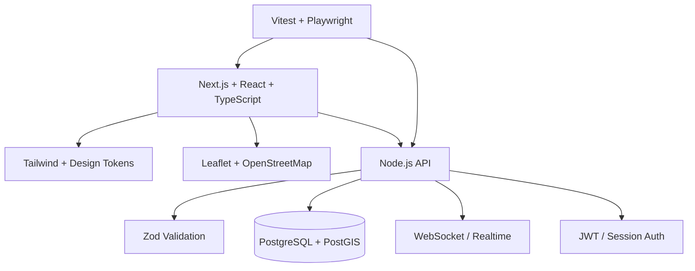

# TRD — Technical Requirements Document

## 1. Technical objective

Create a modular web system that can support the SANKET disaster-response workflow while remaining simple enough for a student prototype and extensible enough for future production integration.

## 2. Technology stack



## 3. Runtime requirements

### Frontend

- TypeScript strict mode
- Responsive layout
- Form validation
- Accessible components
- Map rendering
- API client
- Error and loading states

### Backend

- REST API
- Authentication middleware
- Role authorization
- Request validation
- Service layer
- Database repository layer
- Central error handler
- Audit logging
- Rate limiting

### Database

- PostgreSQL
- PostGIS for coordinates and spatial queries
- Foreign-key constraints
- Indexes for incident status, severity and location
- Transaction support

## 4. API conventions

Base:

```text
/api/v1
```

Examples:

```http
POST   /api/v1/incidents
GET    /api/v1/incidents
GET    /api/v1/incidents/:id
PATCH  /api/v1/incidents/:id
POST   /api/v1/incidents/:id/assign
POST   /api/v1/incidents/:id/status
GET    /api/v1/teams
GET    /api/v1/resources
GET    /api/v1/audit
```

## 5. Example incident request

```json
{
  "type": "FLOOD",
  "description": "Water entered ground floor.",
  "location": {
    "latitude": 22.7196,
    "longitude": 75.8577
  },
  "peopleAffected": 4,
  "vulnerablePeople": 2,
  "needs": ["EVACUATION", "MEDICAL"],
  "contactConsent": true
}
```

## 6. Example response

```json
{
  "id": "8c7d...",
  "reference": "SKT-2026-004821",
  "status": "SUBMITTED",
  "priority": {
    "level": "HIGH",
    "reasons": [
      "Medical need reported",
      "Vulnerable people reported"
    ]
  },
  "createdAt": "2026-09-30T17:00:00Z"
}
```

## 7. API error format

```json
{
  "error": {
    "code": "VALIDATION_ERROR",
    "message": "The request contains invalid fields.",
    "requestId": "req_01J...",
    "fields": {
      "location.latitude": "Required"
    }
  }
}
```

## 8. Performance considerations

- Paginate incident lists.
- Avoid returning full incident history in list endpoints.
- Index common filters.
- Use spatial indexes for geographic queries.
- Debounce map/filter requests.
- Cache read-heavy reference data.
- Use WebSockets only for meaningful live updates.
- Compress large responses.

## 9. Reliability

Every mutation should follow:

```text
Request
  ↓
Authentication
  ↓
Authorization
  ↓
Validation
  ↓
Transaction
  ↓
Database mutation
  ↓
Audit event
  ↓
Response
```

## 10. Offline/degraded mode

The frontend should support:

```text
No connection
    ↓
Save draft locally
    ↓
Show "Pending sync"
    ↓
Connection restored
    ↓
Validate again
    ↓
Submit
```

The demo may use IndexedDB/localStorage for this feature; production should use a more robust offline queue.

## 11. External integrations

Keep providers behind adapters:

```text
NotificationService
 ├── WebNotificationAdapter
 ├── SmsAdapter
 └── FutureGovernmentGatewayAdapter

MapService
 └── OpenStreetMapAdapter
```

This prevents vendor lock-in.
